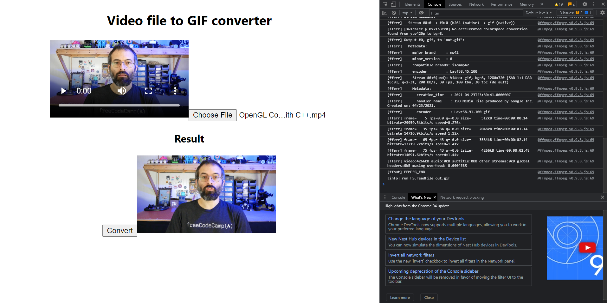

# React webassembly video converter

1. Convert video to gif
2. Extract audio from the video



You would need to run the chrome with this flag to get the project running:
```
chrome --enable-features=SharedArrayBuffer 
```